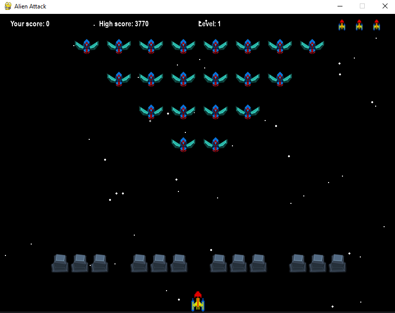

# Alien-Attack
 Galaxians type space invaders program

 Written in Python using Pygame

Instructions

The star background moves down by default giving the appearance of moving up. 
This can be changed by commenting the import and use of stars.py and uncommenting and using field_stars.py.
The alternative gives the appearance of moving into the screen.

I originally wrote this and 3 other retro games in JavaScript for my grandchildren.

If you are interested the site is here http://brace.great-site.net 

Author Paul Brace

paul.brace@gmail.com

April 2024